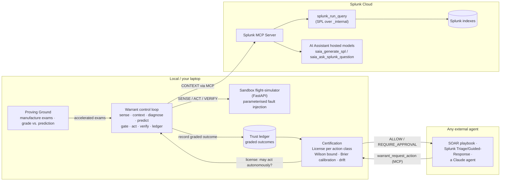

# Warrant — Architecture Diagram

> Submission architecture diagram (Splunk Agentic Ops Hackathon). A longer-form
> narrative version lives at [`docs/architecture.md`](docs/architecture.md).

Warrant is a **licensing authority for AI agents**. Evals tell you how smart an agent is;
Warrant tells production *how much rope to give it* — and takes the rope back. An agent earns a
**license per action class** by passing exams in a proving ground, graded against its own
**falsifiable predictions**. Licenses are revocable on a failure and invalidated when the
agent's brain changes underneath you (model/prompt drift).

## System topology (hybrid)

The sandbox holds the **live telemetry** (a system you can deliberately break and heal).
**Splunk Cloud is the reasoning brain**, reached entirely through the **Splunk MCP Server**.
And Warrant **exposes its own MCP server**, so the trust gate becomes infrastructure any other
agent can call.

## The control loop, step by step

| # | Step | What happens | Splunk / AI touchpoint |
|---|------|--------------|------------------------|
| 1 | **SENSE** | Read live metrics (`error_rate`, `db_connections`, `p95_latency_ms`) | — |
| 2 | **CONTEXT** | Pull real operational context | **MCP `splunk_run_query`** over `_internal`; prefers **`saia_generate_spl`** hosted model to author the SPL |
| 3 | **DIAGNOSE** | A brain (heuristic or LLM) proposes one bounded remediation **and a confidence** | optional Google Gemini |
| 4 | **PREDICT** | Commit to a **falsifiable** forecast band *before* acting — a control limit learned from healthy data | — |
| 5 | **GATE** | Allow only reversible, in-blast-radius actions; act autonomously only with a valid **license** | certification |
| 6 | **ACT** | Execute the bounded remediation | sandbox control API |
| 7 | **VERIFY** | Compare the live metric against the forecast band | — |
| 8 | **LEDGER** | Record the graded outcome (correct?, stated confidence, brain fingerprint); re-certify the license | certification |

## What makes a license

A license for an action class is granted only when **three independent conditions** hold:

- **Confidence** — the Wilson score lower bound on the hit-rate clears the threshold, so one
  lucky pass can never license an action.
- **Evidence** — there is a minimum body of graded outcomes behind it.
- **Calibration** — the **Brier score** (mean squared error between stated confidence and
  reality) is low enough. An agent that is *confidently wrong* fails calibration even if its raw
  hit-rate looks acceptable.

States: `PROVISIONAL` (training / re-certifying) → `LICENSED` (autonomous) → `SUSPENDED`
(was licensed, a failure revoked it). A fingerprint change forces any license back to
PROVISIONAL.
