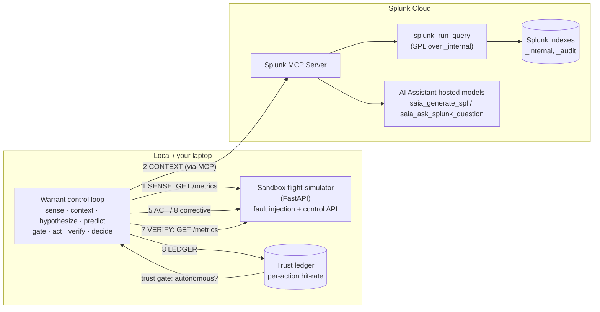

# Warrant — Architecture

Warrant is an autonomous remediation agent that **earns the right to act**. It runs a closed
control loop and is permitted to act on a system only to the degree its past *falsifiable
predictions* have survived contact with reality.

## Topology (hybrid)

The sandbox holds the **live telemetry** (a system you can deliberately break and heal).
**Splunk Cloud is the reasoning brain**, reached entirely through the **Splunk MCP Server**.

## The loop, step by step

| # | Step | What happens | Splunk / AI touchpoint |
|---|------|--------------|------------------------|
| 1 | **SENSE** | Read live metrics (`error_rate`, `db_connections`, `p95_latency_ms`) | — |
| 2 | **CONTEXT** | Pull real operational context | **MCP `splunk_run_query`** over `_internal`; prefers **`saia_generate_spl`** hosted model to author the SPL |
| 3 | **HYPOTHESIZE** | Diagnose a root cause and choose a remediation | — |
| 4 | **PREDICT** | Commit to a **falsifiable** forecast band *before* acting | — |
| 5 | **GATE** | Allow only reversible, in-blast-radius actions | — |
| 6 | **ACT** | Execute the bounded remediation | sandbox control API |
| 7 | **VERIFY** | Compare the live metric against the forecast band | — |
| 8 | **DECIDE + LEDGER** | In-band → resolve. Out-of-band → *"I was wrong"* → escalate + corrective rollback. Record outcome; update the per-action-class trust score | — |

## Why this design

- **Trust is earned, not assumed.** An action class acts autonomously only while its ledger
  hit-rate clears a threshold (default 95%); otherwise it stays human-in-the-loop. The agent
  *graduates* the way you'd onboard a junior engineer.
- **Falsifiability is the safety mechanism.** Because the agent states, in advance, exactly
  what would prove it wrong, "wrong" is detectable in real time — which makes autonomous
  action safe enough to ship.
- **Splunk MCP Server is the single interface to Splunk** — every read of Splunk data and
  every hosted-model call goes through it (Best MCP Server Use), keeping the agent decoupled
  from Splunk internals.

## Data flow summary

1. Telemetry originates in the sandbox and is read directly by the loop (low latency).
2. For each incident the agent queries **real Splunk data via MCP** for operational context.
3. Remediation is actuated against the sandbox's reversible control API.
4. Every decision (prediction → outcome) is persisted to the trust ledger, which in turn
   gates whether future actions of that class may run autonomously.
